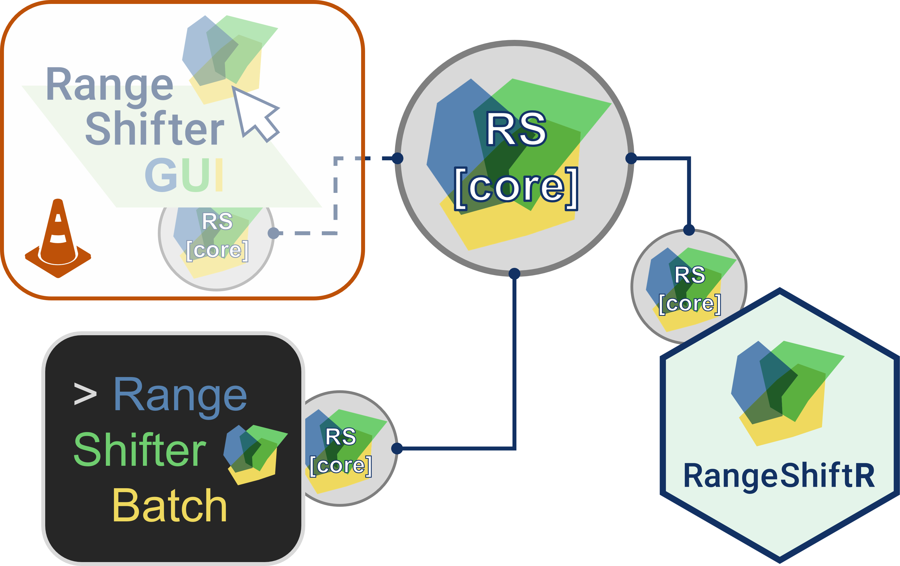
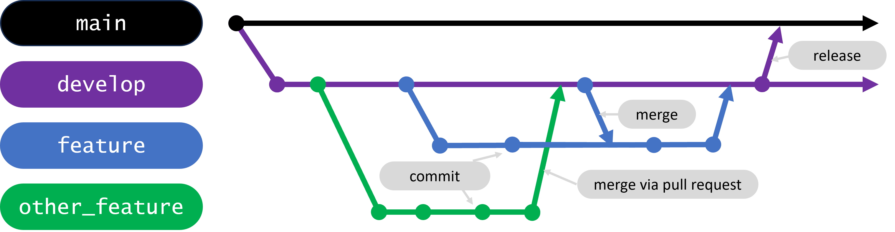

# The RangeShifter platform - An eco-evolutionary modelling framework

## How to contribute

Thank you for your interest in contributing to the RangeShifter platform. 
In this document we will give you guidance on how to contribute to the RangeShifter project regarding issues, bug fixing and adding new features. In this guidance we distinguish between contributing to the RangeShifter core code and the R interface (RangeShiftR package).

## Repo structure

RangeShifter is distributed with three user interfaces, each living in their own repo:

- the RangeShifter GUI (clickable Windows interface)*
- RangeShifter Batch Mode (command line interface)
- the RangeShiftR package (R interface)

All three share the same source code for the core simulation (i.e., the actual model), which lives in its own repo (RScore). Each of the interfaces keeps a copy of this core code in a subfolder called RScore, kept in sync with the RScore repo via a git subtree (see Git subtree usage section). 

⚠️ If you wish to propose a change to the core code of the simulation, please do so *in the [RScore](https://github.com/RangeShifter/RScore) repo*, rather than in the RScore folder of either interface.

*The RangeShifter GUI is currently being rewritten, and is not open source yet.

## Roles

#### Maintainers

- [@JetteReeg](https://github.com/JetteReeg)
- [@TheoPannetier](https://github.com/TheoPannetier)

Maintainers are responsible for coordinating development efforts and ensuring that RangeShifter keeps building continuously.

#### Developers

Regular contributors and members of the [RangeShifter development team](https://github.com/orgs/RangeShifter/people), including maintainers.

#### Contributors

Anyone who whishes to make changes to RangeShifter's code, including regular developers.

## Branching policy

This policy applies to RScore and all three RangeShifter interfaces.
RangeShifter uses the following branching structure:

- `main` is the default branch, where stable releases live. Because it contains the version of RangeShifter that users normally interact with, it must be stable and build at all times.
  Only maintainers should make significant changes to `main`, normally by merging `develop` into `main` to make newly developed features and bug fixes available to users, and marking a release while doing so.
- `develop` is the development branch containing new, in-development features. It is the reference branch for all developers. Contributors may make small changes and bug fixes directly to `develop` but should ensure that new changes do not break the build. If one happens to break `develop`, it should be their top priority to fix it as this will disrupt the work of all other contributors.
  Larger changes should instead be developed on feature branches.
- Larger changes should be first developed on feature (e.g. `cmake`, `mutualism`, etc.) or contributor (e.g., `theo`) branches. Contributors are welcome to experiment and break such branches at any time, as this will not impact users or other contributors.
  
  When progress is deemed satisfactory, changes can be brought to `develop`. Please open a pull request on GitHub, and assign at least one maintainer as a reviewer. As a pre-requisite, RangeShifter must build on the branch before merging. Please enter a descriptive title and use the description field to describe what you have changed. 
  
  In the meantime, we encourage contributors to work in small and frequent commits, and to merge `develop` into their branch often to update their branch with newest changes.
  
  
  

If you need a reminder on the main git commands related to committing and branching, head to the [Git cheatsheet](https://github.com/RangeShifter/RScore/blob/development-guidelines/git_cheatsheet.md).

## Contributing to the RangeShiftR package

Please follow these guidelines for issues, bugs or new features related to the RangeShiftR-package. 

### Issues and bugs

Issues should be used for reporting technical problems and bugs with the R package or suggest improvements e.g. in the documentation. 
Questions regarding the application and settings of the RangeShiftR should be asked in the [discussion forum](https://github.com/RangeShifter/RangeshiftR-tutorials/discussions).

#### Create a new issue

If you encounter a technical problem, find a bug in the RangeShiftR package or would like to suggest an improvement to the package, please search if [a related issue already exists](https://github.com/RangeShifter/RangeShiftR-package-dev/issues). If you can't find a related issue, you can open a new issue using a relevant [issue form](https://github.com/RangeShifter/RangeShiftR-package-dev/issues/new/choose). To propose a bug fix (thank you!!), please create and work on your own branch or fork, from either `main` or `develop` (preferred), and open a pull request when your fix is ready to be merged into the original branch.

The RangeShiftR maintainer and development team will take care of opened issues. However, feel free to scan through [existing issues](https://github.com/RangeShifter/RangeShiftR-package-dev/issues) and leave comments. 

### New feature

Do you have an idea of a new feature in the RangeShiftR package that should be integrated and is of use for other RangeShiftR users? 
Please get in touch with the RangeShifter development team directly (rangeshiftr@uni-potsdam.de (*or other mail?*) to discuss a collaboration.

Alternatively*, proceed as with the bug fix above: create your own branch _from `develop`_ and work from there, and submit a pull request when your new features are ready to join the core code. 
We recommend that you update your branch regularly to new changes on `develop` (using `git merge develop`) to reduce the risk of merge conflicts or your version getting out-of-touch in the late stages of development.
We also recommend that you work in small commits, as this makes the code easier to debug, and makes it easier for maintainers to understand your contributions when reviewing a pull request.

*Do we welcome independent contributions?

## Contributing to the RangeShifter core code

Any changes (issues, bugs, features) regarding the RangeShifter core code should be done in this repository and can afterwards be synced with all interfaces using the git subtree feature (see [Git subtree](https://github.com/RangeShifter/RScore/tree/main#usage-git-subtrees) section in the README). 

#### Bugs

To report a bug, please [open an issue](https://github.com/RangeShifter/RScore/issues/new), using the Bug Report template. 
Please do check if a related issue has already open on one of the other interfaces ([here](https://github.com/RangeShifter/RangeShiftR-package-dev/issues) for the R package interface).
To propose a bug fix (thank you!!), please create and work on your own branch or fork, from either `main` or `develop` (preferred), and open a pull request when your fix is ready to be merged into the original branch.

Maintainers will review the pull request, possibly request changes, and eventually integrate the bug fix into RScore, and update the subtrees to bring the fix to all interfaces.

#### New features

Do you have an idea of a new feature in the RangeShifter platform that should be integrated and is of use for other RangeShifter users? 
Please get in touch with the RangeShifter development team (rangeshiftr@uni-potsdam.de (*or other mail?*) to discuss a collaboration.

Alternatively*, proceed as with the bug fix above: create your own branch or fork _from `develop`_ and work from there, and submit a pull request when your new features are ready to join the core code. 
We recommend that you update your branch regularly to new changes on `develop` (using `git merge develop`) to reduce the risk of merge conflicts or your version getting out-of-touch in the late stages of development.
We also recommend that you work in small commits, as this makes the code easier to debug, and makes it easier for maintainers to understand your contributions when reviewing a pull request.

*Do we welcome independent contributions?

