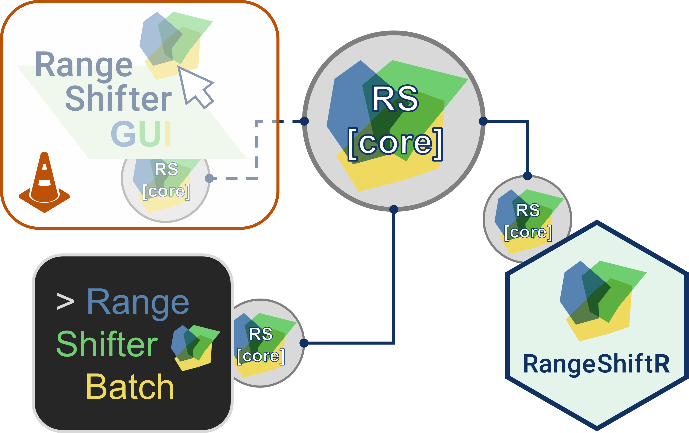
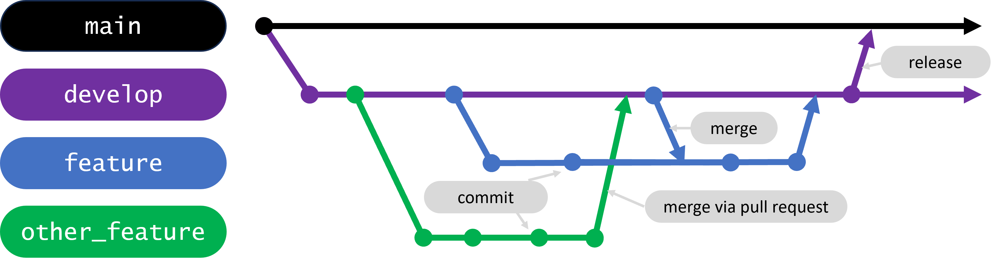

# The RangeShifter platform - An eco-evolutionary modelling framework

## How to contribute

Thank you for your interest in contributing to the RangeShifter platform. 
In this document we will give you guidance on how to contribute to the RangeShifter project regarding issues, bug fixing and adding new features. We distinguish between contributing to the RangeShifter core code and the different interfaces - in this case the R package.

## Repo structure

RangeShifter is distributed with three user interfaces, each living in their own repo:

- the [RangeShifter GUI](https://github.com/RangeShifter/RangeShifter_GUI) (clickable Windows interface)*
- RangeShifter [Batch Mode](https://github.com/RangeShifter/RangeShifter_batch) (command line interface)
- the [RangeShiftR](https://github.com/RangeShifter/RangeShiftR-pkg) package (R interface)

All three share the same source code for the core simulation (i.e., the actual model), which lives in its own repo (RScore). Each of the interfaces keeps a copy of this core code in a subfolder called RScore, kept in sync with the RScore repo via a git subtree (see [Git subtree usage section](https://github.com/RangeShifter/RScore?tab=readme-ov-file#usage-git-subtree). 

⚠️ If you wish to propose a change to the core code of the simulation, please do so *in the [RScore](https://github.com/RangeShifter/RScore) repo*, rather than in the RScore folder of either interface.

*The RangeShifter GUI is currently not maintained and only available with RangeShifter v2.0.

## Roles

#### Maintainers

- [@JetteReeg](https://github.com/JetteReeg): RScore repo and lead in R package

Maintainers are responsible for coordinating development efforts and ensuring that RangeShifter keeps building continuously.

#### Developers

Regular contributors and members of the [RangeShifter development team](https://github.com/orgs/RangeShifter/people), including maintainers.

#### Contributors

Anyone who whishes to make changes to RangeShifter's code, including regular developers.

## Branching policy

This policy applies to RScore and all three RangeShifter interfaces.
RangeShifter uses the following branching structure:

- `main` is the default branch, where the stable releases live. Because it contains the version of RangeShifter that users normally interact with, it must be stable and build at all times.
Only maintainers should make changes to `main`, either directly for small changes (e.g. typo fixes), or by merging `develop` into `main` for any larger change.
- `develop` is the development branch containing new features not yet made available to users.
Contributors are welcome to make changes to `develop`, but because this is the version that every contributor uses as a reference, one should ensure that new changes do not break `develop`.
If one happens to break `develop`, it should be their first priority to fix it.
For this reason, we recommend working from feature branches instead.
- Feature branches are created from `develop` by contributors to work on a new feature or other change, e.g. `cmake`, `mutualism`, etc. 
Contributors can also create their own branch, e.g. `theo` or `jette` to experiment with the code or implement miscellaneous changes.
Once a contributor deems their changes ready to be added to the development version, they should merge their changes from the feature branch into `develop`.
Optionally, we encourage contributors to seek a review from one or more developers and or maintainers by opening a pull request to merge their branch into develop.
  
### Contributing to RangeShifter core code
  
Any changes regarding the RangeShifter core code should be done in [this](https://github.com/RangeShifter/RScore) repository and can afterwards be synced with all interfaces using the git subtree feature (see [Git subtree](https://github.com/RangeShifter/RScore/tree/main#usage-git-subtrees) section in the README).

#### Bugs

To report a bug, please [open an issue](https://github.com/RangeShifter/RangeShiftR-pkg/issues/new), using the Bug Report template. 
Please do check if a related issue has already open on one of the other interfaces ([here](https://github.com/RangeShifter/RangeShifter_batch/issues) for the batch interface).
To propose a bug fix (thank you!!), please create and work on your own branch or fork, from either `main` or `develop` (preferred), and open a pull request when your fix is ready to be merged into the original branch.

### Contributing to the RangeShiftR package

Please follow these guidelines for issues, bugs or new features related to the RangeShiftR-package. 

#### Issues and bugs

Issues should be used for reporting technical problems and bugs with the R package or suggest improvements e.g. in the documentation. 
General and more conceptual questions regarding the application and settings of RangeShifter parameters should be asked in the [discussion forum](https://github.com/RangeShifter/RangeshiftR-tutorials/discussions) and answered by the broader RangeShifter community.

#### Create a new issue

If you encounter a technical problem, find a bug related to the RangeShiftR package or would like to suggest an improvement to the R package, please search if [a related issue already exists](https://github.com/RangeShifter/RangeShiftR-package-dev/issues). If you can't find a related issue, you can open a new issue using a relevant [issue form](https://github.com/RangeShifter/RangeShiftR-pkg/issues/new/choose). To propose a bug fix (thank you!!), please create and work on your own branch or fork, from either `main` or `develop` (preferred), and open a pull request when your fix is ready to be merged into the original branch.

As a prerequisite for merging, please ensure that the R package is build correctly. GitHub Action will soon be used for ensuring a successfull build of the R package interface on all operating systems (i.e. R CMD CHECK needs to run without warnings).

Maintainers will review the pull request, possibly request changes, and eventually integrate the bug fix into the RangeShiftR package. 

### New feature

Do you have an idea of a new feature in the RangeShiftR package that should be integrated and is of use for other RangeShiftR users? 
Please get in touch with the RangeShifter development team directly (rangeshiftr@uni-potsdam.de) to discuss a collaboration.

⚠️ We advise to contact the developer team as early as possible if you plan on implementing a new feature of the R package interface. This could prevent simultaneous development of the same feature and coordinate potential joint development.

Alternatively, proceed as with the bug fix above: create your own branch _from `develop`_ and work from there, and submit a pull request when your new features are ready to join the core code. 
We recommend that you update your branch regularly to new changes on `develop` (using `git merge develop`) to reduce the risk of merge conflicts or your version getting out-of-touch in the late stages of development.
We also recommend that you work in small commits, as this makes the code easier to debug, and makes it easier for maintainers to understand your contributions when reviewing a pull request.

